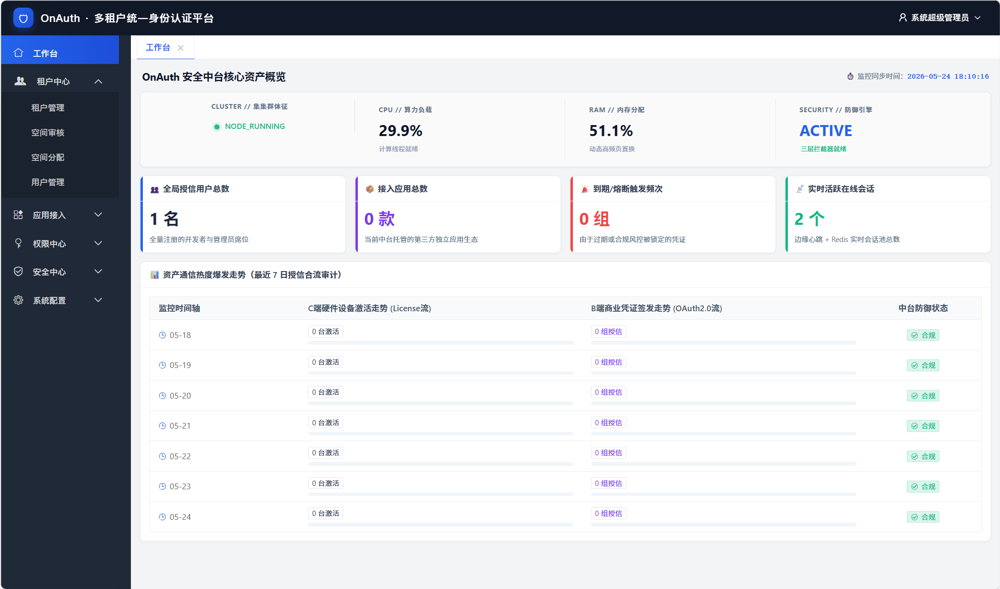
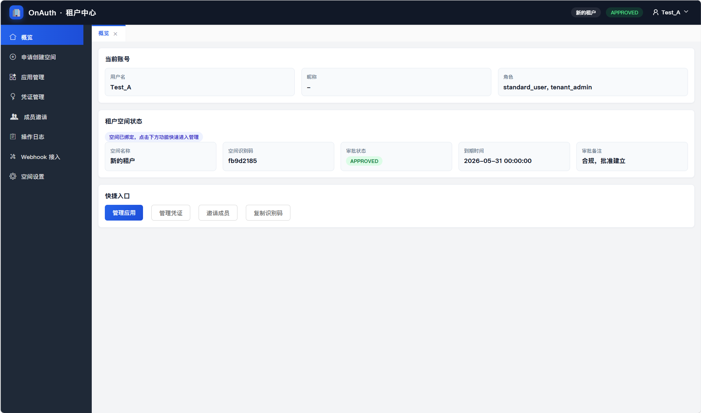
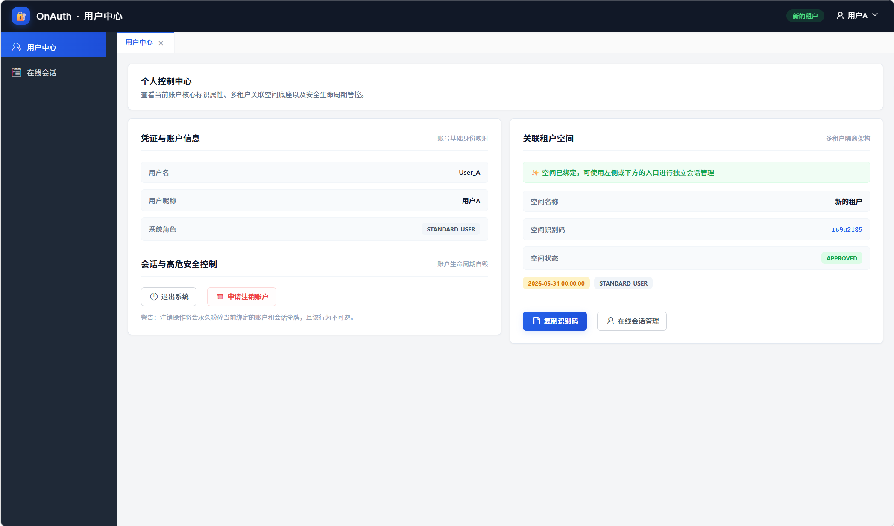

# 🛡️ OnAuth 多租户统一身份认证与访问控制系统


**企业级 OAuth2.0 + License 双轨鉴权 · RBAC · 多租户 · 风控 · 会话管理**

---

## 目录

- [项目简介](#项目简介)
- [功能亮点](#功能亮点)
- [界面截图](#界面截图)
- [标准测试软件](#标准测试软件)
- [快速启动](#快速启动)
- [第三方接入](#第三方接入)
- [项目结构](#项目结构)
- [配置说明](#配置说明)
- [风控能力](#风控能力)
- [测试](#测试)
- [公开发布清单](#公开发布清单)
- [许可证](#许可证)

---

## 项目简介

OnAuth 是一个面向企业内网 / 中台 / 多租户场景的统一身份认证与访问控制系统，提供：

- OAuth 2.0 授权登录（`authorization_code + PKCE`、`client_credentials`、`refresh_token`）
- 基于 RBAC 的权限控制
- 多租户空间管理与成员管理
- Webhook 订阅与审计
- 风控规则引擎与全局熔断
- 普通用户会话管理
- 应用凭证与设备绑定控制
- 管理端 / 租户端 / 用户中心三套 Web 界面

---

## 功能亮点

| 模块 | 能力 |
| --- | --- |
| 认证 | OAuth2 授权、PKCE、刷新令牌、客户端凭证 |
| 用户 | 登录、注册、资料管理、在线会话管理 |
| 租户 | 空间申请、审核、成员邀请、应用管理 |
| 应用 | 客户端管理、密钥、白名单、设备管理 |
| 风控 | 登录失败验证码、扫描器拦截、SQL 注入、XSS、敏感路径探测、全局熔断 |
| 安全 | Bcrypt 密码哈希、JWT、Redis 会话、设备绑定 |
| 运维 | 健康检查、审计日志、Webhook、Alembic 迁移 |

---

## 界面截图

### 系统管理端



### 租户管理端



### 用户端



---

## 标准测试软件

仓库根目录下提供了一个标准化的 OAuth 2.0 + PKCE 测试软件：`Test_App_A.py`。

### 功能说明

- 自动生成 PKCE `code_verifier` / `code_challenge`
- 启动本地回调监听，拦截授权码 `code`
- 使用授权码换取 `access_token` 和 `refresh_token`
- 支持刷新令牌测试
- 所有失败、告警、网络异常、协议失败都会输出到日志面板

### 启动方式

```bash
python Test_App_A.py
```

### 使用步骤

1. 填写 `Backend URL`、`Redirect URI`、`Client ID`
2. 如有需要可填写 `Client Secret`
3. 点击“启动 PKCE 测试”
4. 在浏览器中完成授权
5. 观察下方“运行日志 / 告警输出”与令牌输出区域

### 适用场景

- 调试 OAuth 2.0 授权码流程
- 验证 PKCE 是否生效
- 检查后端是否正确返回登录失败、授权失败、刷新失败等告警
- 作为桌面端测试桩 / 演示工具使用

---

## 快速启动

### 1. 创建虚拟环境

```bash
python -m venv .venv
```

### 2. 激活虚拟环境

**Windows**

```powershell
.venv\Scripts\Activate.ps1
```

**Linux / macOS**

```bash
source .venv/bin/activate
```

### 3. 安装依赖

```bash
pip install -r requirements.txt
```

### 4. 启动服务

```bash
python main.py
```

启动后可访问：

- Swagger：`https://127.0.0.1:8000/docs`
- ReDoc：`https://127.0.0.1:8000/redoc`

> 首次启动时，系统会自动初始化数据库结构、默认角色、默认风控规则和演示账号。

---

## 第三方接入

第三方接入与授权码模式的详细流程请参考：

- [docs/third_party_integration.md](docs/third_party_integration.md)
- [docs/oauth_bootstrap_one_click.md](docs/oauth_bootstrap_one_click.md)

推荐流程：第三方网站不直接注册本地账号，注册与登录统一交由 OnAuth 完成，通过 OAuth 获取用户资料后在本地创建/更新用户。

---

## 项目结构

```text
OnAuth/
├─ app_factory.py          # FastAPI 应用装配
├─ bootstrap.py            # 启动初始化、默认角色/规则种子
├─ config.py                # 当前版本的基础配置
├─ database.py              # ORM 模型与数据库连接
├─ main.py                  # 启动入口
├─ Test_App_A.py            # OAuth 2.0 + PKCE 标准测试软件
├─ routers/                 # OAuth、管理端、租户端、用户端 API
├─ middlewares/             # RBAC、异常处理、操作日志
├─ utils/                   # 认证、安全、风控、验证码等工具
├─ admin_web/               # 管理端页面
├─ tenant_web/              # 租户端页面
├─ user_web/                # 用户中心页面
├─ templates/               # 通用模板
└─ tests/                   # pytest 回归测试
```

---

## 配置说明

### 当前版本的配置方式

本项目目前仍以 `config.py` 为主进行基础配置，包括：

- 数据库类型
- JWT 密钥
- 数据库连接串

如果你准备部署到自己的环境，建议先检查并修改 `config.py`，避免直接使用仓库里的默认值。

### 建议的生产化方向

后续建议将以下内容改为环境变量：

- `SECRET_KEY`
- 数据库账号密码
- 生产环境域名
- 管理员初始密码
- 端口和协议配置

---

## 风控能力

当前风控系统支持基于表达式的动态规则配置，默认内置策略包括：

- 登录失败验证码
- 防扫描器
- 防恶意 UI / 自动化
- 防 SQL 注入
- 防 XSS 注入
- 高危路径探测

同时支持：

- 全局熔断
- 风控事件记录
- 规则启用 / 停用
- 管理端可视化维护

---

## 测试

```bash
pip install -r requirements-dev.txt
pytest -q
```

当前仓库已经包含关键回归测试，覆盖了：

- 密码哈希与令牌逻辑
- 风控表达式引擎
- OAuth 重定向 URI 匹配
- 用户会话管理
- 设备数量限制
- Windows 异步噪音过滤

---
## 许可证

本项目遵循 **Apache License 2.0**。

你可以自由使用、修改和分发本项目，但请保留原始版权与许可证声明。
